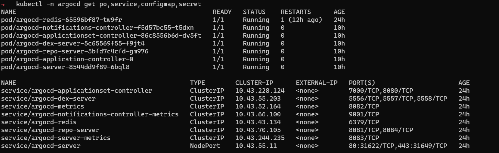

# 설치



## 설치방법


튜토리얼 설치 방법은 연습을 위해 설정이 되어 있으므로 운영에서 사용할 때는 설정을 검토해야 합니다. 그리고 운영환경은 안전성을 위해 고가용 설정이 필요합니다.


argocd namespace를 생성하고 공식문서 가이드([https://argo-cd.readthedocs.io/en/stable/#getting-started](https://argo-cd.readthedocs.io/en/stable/#getting-started))에서 제공하는 yaml파일을 kubectl apply해주면 됩니다.

```shell
kubectl create namespace argocd
kubectl apply -n argocd -f https://raw.githubusercontent.com/argoproj/argo-cd/stable/manifests/install.yaml
```

.png>)

## 설치확인

argocd 컴퍼넌트와 DB(redis)가 pod로 실행됩니다. 이 외에 serviceaccount, role, rolebinding 등이 있습니다.

```
kubectl -n argocd get po,service,configmap,secret
```



## WEB UI 접속&#x20;

WEB UI에 접속하려면 service에서 argocd-server를 포트포워딩 하거나 NodePort 또는 LoadBalancer변경해야 합니다. 포트포워딩 명령어는 아래와 같습니다.

```
kubectl port-forward svc/argocd-server -n argocd 8080:443
```


포트포워딩 후, http://localhost:8080으로 접속하면 로그인 페이지로 이동됩니다. 로그인을 위해 비밀번호가 필요합니다. 초기 비밀번호는 secret에 저장되어 있습니다.

```shell
kubectl -n argocd get secret argocd-initial-admin-secret -o jsonpath="{.data.password}" | base64 -d; echo
```


로그인을 성공하면 아래 그림과 같이 대시보드가 보입니다.


