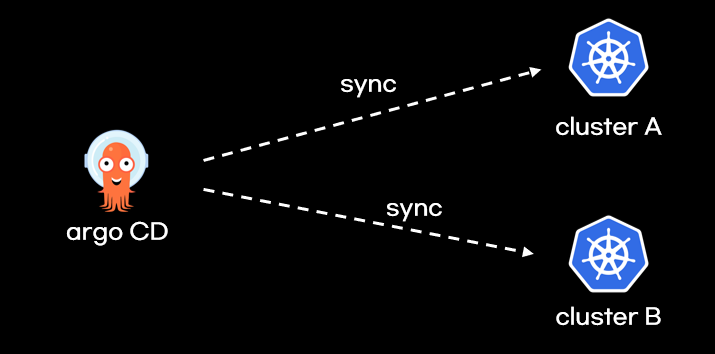

# 클러스터 추가


참고자료: [https://argo-cd.readthedocs.io/en/stable/operator-manual/declarative-setup/#clusters](https://argo-cd.readthedocs.io/en/stable/operator-manual/declarative-setup/#clusters)



## 개요

argo CD는 여러 클러스터를 대상으로 git의 리소스를 sync할 수 있습니다. default 클러스터는argocd가 설치된 클러스터입니다.

<figure><figcaption></figcaption></figure>

## 클러스터 추가

2가지 방법(token, 인증서)으로 클러스터를 추가할 수 있습니다.


### Token 설정

```yaml
apiVersion: v1
kind: Secret
metadata:
  name: mycluster-secret
  namespace: argocd
  labels:
    argocd.argoproj.io/secret-type: cluster
type: Opaque
stringData:
  name: mycluster.com
  server: https://mycluster.com
  config: |
    {
      "bearerToken": "<authentication token>"
    }
```


### 인증서 설정

```yaml
apiVersion: v1
kind: Secret
metadata:
  name: mycluster-secret
  namespace: argocd
  labels:
    argocd.argoproj.io/secret-type: cluster
type: Opaque
stringData:
  name: mycluster.com
  server: https://mycluster.com
  config: |
    {
      "tlsClientConfig": {
        "insecure": false,
        "caData": "<base64 encoded certificate>",
        "certData": "<base64 encoded certificate>",
        "keyData": "<base64 encoded key>"
      }      
    }
```


## 클러스터 확인

<figure><figcaption></figcaption></figure>

<mark style="color:red;">추가한 클러스터에 argo cd application을 한번도 생성하지 않으면 Unknown상태일 수 있습니다</mark>. 그러므로, 클러스터가 잘 설정되었는지 확인하려면, 클러스터 추가 후 argo cd application을 생성해보세요.

<figure><figcaption></figcaption></figure>
